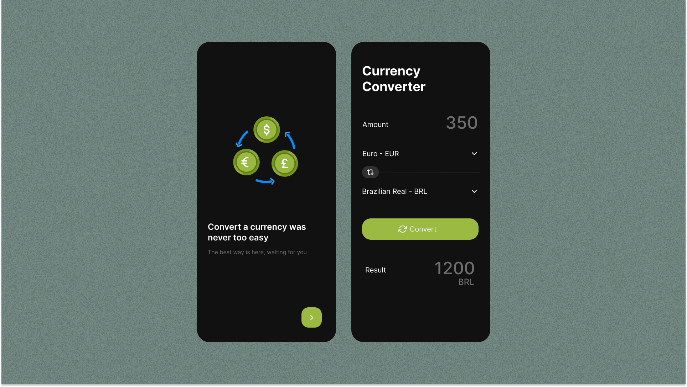

<h1></h1> 

Currency Converter App, provides an simple way to convert any currencies. The main idea
for this project, is for studying and apply modularization with mono-repo and
managed by Melos CLI, it follows some development best practices, such as Clean
Architecture, Clean Code, SOLID, and more.

It is a **work in progress** 🚧.

# Features

The project has only two features, called `:feature_conversion` and
`:feature_currencies_list`, you can see more details in the app modularization
guide.

## Screenshots

