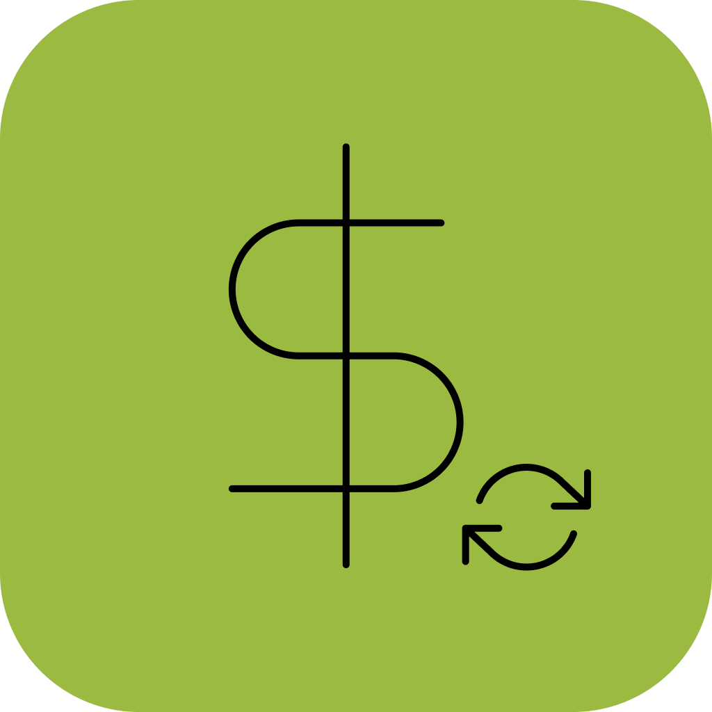
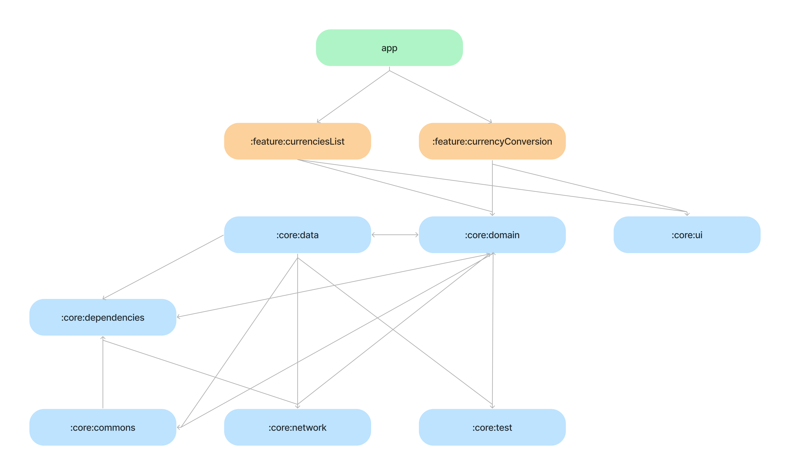

<h1 align="center">
  
</h1>

<p align="center">
  <a href="https://opensource.org/licenses/Apache-2.0"></a>
  <a href="https://medium.com/@willAmaral"></a>
  <a href="https://www.instagram.com/wiidev/"></a>
</p>

Currency Converter App, provides a simple way to convert any currency. The main idea
for this project, is for studying and apply modularization with mono-repo and
managed by Melos CLI, it follows some development best practices, such as Clean
Architecture, Clean Code, SOLID, and even more.

It is a **work in progress** 🚧

# Content

- **[Features](#features)**
- **[Screenshots](##screenshots)**
- **[App Modularization Guide](#app-modularization-guide)**
- **[UI and Design](#ui-and-design)**
- **[Technical Resources](#technical-resources)**
- **[Getting Started](#getting-started)**
<!-- - **[App Flow Sample](#app-flow-sample)** -->

<br>

# Features

The project has only two features, called `:feature_conversion` and
`:feature_currencies_list`, you can see more details in the [app modularization
guide](#app-modularization-guide).

## Screenshots


# App Modularization Guide

The project uses an modularization approach with mono-repo, to organize
and breaking the concept of monolithic into loosely coupled, self contained
modules.


A module graph of currency app, the arrows flow indicates the dependency way.

The project contains the following types of modules:

- The `app` module - is the main entry point for the app, this module contains
  all the app level code, such as navigation, dependency injection setting, state
  management and other similar things.

- `feature` modules - contains specific modules which has a single responsibility
  and should have no dependencies on other `feature` modules. They only depend on
  the `core` modules that they require.

- `core` modules - common library modules and specific dependencies that need to be
  shared between other modules in the app. These modules can depend on other core modules,
  but they shouldn’t depend on feature or app modules.

All these modules are managed by Melos CLI, with this tool, we have more control
over the dependencies in the whole project and executes common tasks in all modules
in the same time -- [know more about Melos here](https://melos.invertase.dev/).
You can see, some scripts that is used by the project on `melos.yaml` file in the
root directory.

As a mentioned above, the project uses an mono-repo approach to organize all
the modules, this means that all the necessary modules exists inside this repository.
As you can see bellow:

```
  .
  |__app
  |
  |__packages
  |  |
  |  |__core
  |  |  |__core...
  |  |
  |  |__feature
  |     |__feature...
  |
  |_melos.yaml
```

Some advantages of this approach:

- Help us to split our codebase into small and independents packages,
  which is great for reuse and testing
- Keep everything stored in one place, which saves a lot of time, when is searching
  for specific module
- Enforces layered architecture, because all the packages refers to an specific layer

# UI and Design

The app was designed with an simple and minimalist purpose, we use the concepts
of design tokens and atomic design, you can find more about in the
[figma file](https://www.figma.com/file/aBGCDeRuqnngXxhlY4p2O9/Currency-Converter-App-Case-Study?node-id=45%3A39&t=5egYOZqyjrlwngih-1).

The app has supports for dark and light mode, you can find all components and tokens
in the `:core_ui` package.

# Technical Resources

- Clean Architecture and SOLID concepts
- Modularization Approach with mono-repo
- Mono-repo management with Melos CLI
- Dependency Injection in multiple modules with `GetIt` and `Injectable`
- Design System and tokens for UI
- Lottie Animations
- State management with Change Notifier

# Getting Started

Follow these steps to configure and execute the project in your machine:

1. First of all, you need the Flutter SDK and Android/iOS environments to
   continue -- find more information about this [process here](https://docs.flutter.dev/get-started/install).

2. After had finish the setup of your environment, go to the project directory,
   and run the following command:

```shell
melos bootstrap
```

This command runs `flutter pub get` in all modules at the same time and run
`build runner` when the dependencies are installed with successful.

3. Finally run the app with:

```shell
flutter pub run
```
