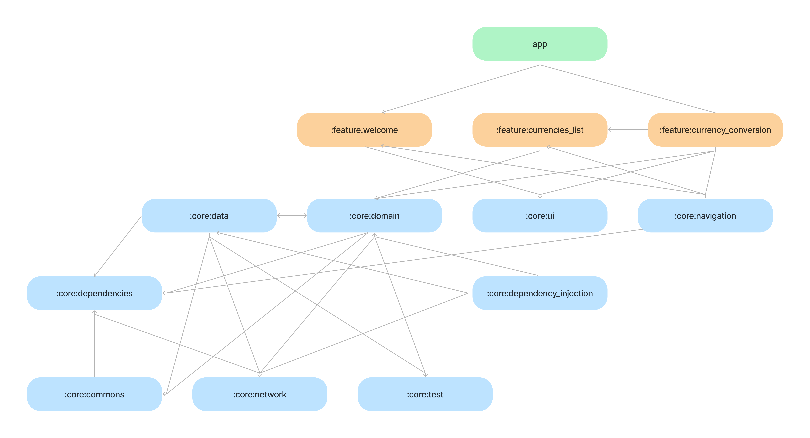

<h1></h1><br>

Currency Converter App, provides an simple way to convert any currencies. The main idea
for this project, is for studying and apply modularization with mono-repo and
managed by Melos CLI, it follows some development best practices, such as Clean
Architecture, Clean Code, SOLID, and even more.

It is a **work in progress** 🚧

# Features

The project has only two features, called `:feature_conversion` and
`:feature_currencies_list`, you can see more details in the app modularization
guide.

## Screenshots


# App Modularization Guide

The project uses an modularization approach with mono-repo, to organize
and breaking the concept of monolithic into loosely coupled, self contained
modules.


A module graph of currency app, the arrows flow indicates the dependency way.

The project contains the following types of modules:

- The `app` module - is the main entry point for app, and in this module has
  all code related to app level, such navigation and other similar things.

- `feature` modules - contains specific modules which has a single responsibility
  and should have no dependencies on other `feature` modules. They only depend on
  the `core` modules that they require.

- `core` modules - common library modules and specific dependencies that need to be
  shared between other modules in the app. These modules can depend on other core modules,
  but they shouldn’t depend on feature or app modules.

All these modules are managed by Melos CLI, with this tool, we have more control
over the dependencies in the whole project and executes common tasks in all modules
in the same time -- [know more about Melos here](https://melos.invertase.dev/).
You can see, some scripts that is used by project on `melos.yaml` file in the
root directory.

As a mentioned above, the project uses an mono-repo approach to organize all
the modules, this means that, all the necessary modules exists inside this repository.
As you can see bellow:

```
  .
  |__app
  |
  |__packages
  |  |
  |  |__core
  |  |  |__core...
  |  |
  |  |__feature
  |     |__feature...
  |
  |_melos.yaml
```

Some advantages of this approach:

- Help us to split our codebase into small and independents packages,
  which is great for reuse and testing
- Keep everything stored in one place, which saves a lot of time, when is searching
  for specific module
- Enforces layered architecture, because all the packages refers to an specific layer
